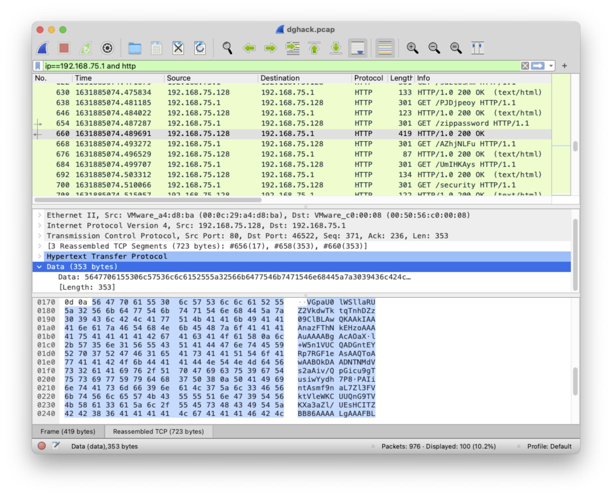

# PCAP 101

https://www.dghack.fr/challenges/dghack/pcap-101/

> Un flux TCP suspect nous a été fourni, pouvez-vous découvrir les données qui s'y cachent ?

Le [fichier joint](dghack2021-pcap101.tar.gz) est un PCAP que l'on va charger dans un wireshark.  La capture contient principalement des échanges HTTP de ce qui semble être une sorte de scan de 192.68.75.1 vers 192.68.75.128.  Dans celui-ci on repère rapidement un échange différent des autres, qui semble être une attaque réussie:  



Le payload de cet échange est un base64: que l'on décode par : 

```
% B64=$(cat << B64
VGpaU0lWSllaRUZ2VkdwTktqTnhDZz09ClBLAwQKAAkIAAAnazFThNkEHzoAAAAuAAAABgAcAOaX
l+W5n1VUCQADGntEYRp7RGF1eAsAAQToAwAABOkDAADNTNMdVs2aAiv/QpGicu9gTusiwYydh7P8
PAIintAsmf9naL7Zl3FVktVleWKCUUQnG9TVKXa3aZl/UEsHCITZBB86AAAALgAAAFBLAQIeAwoA
CQgAACdrMVOE2QQfOgAAAC4AAAAGABgAAAAAAAEAAACkgQAAAADml5fluZ9VVAUAAxp7RGF1eAsA
AQToAwAABOkDAABQSwUGAAAAAAEAAQBMAAAAigAAAAAA
B64
)

% echo $B64 | base64 -d > zippassword

% cat zippassword | hexdump -C | head -n 3
00000000  54 6a 5a 53 49 56 4a 59  5a 45 46 76 56 47 70 4e  |TjZSIVJYZEFvVGpN|
00000010  4b 6a 4e 78 43 67 3d 3d  0a 50 4b 03 04 0a 00 09  |KjNxCg==.PK.....|
00000020  08 00 00 27 6b 31 53 84  d9 04 1f 3a 00 00 00 2e  |...'k1S....:....|
```

On reconnaîtra ce qui semble être un base64 (à nouveau) concaténé à un zip (signature `50 4b 03 04` `PK..`), ce qui correspond bien à la requête HTTP `GET /zippassword HTTP/1.1`.  Séparons donc les deux:

```
% CUT_INDEX=25
% dd count=${CUT_INDEX} if=zippassword bs=1 > zippassword.1stpart 
% dd skip=${CUT_INDEX} if=zippassword bs=1 > zippassword.2ndpart.zip
% cat zippassword.1stpart | base64 -D
N6R!RXdAoTjM*3q
```

Nous sommes en présence d'un zip protégé par mot de passe, et de son mot de passe associé.  Le dézippage nous donne un fichier avec un nom en caractères chinnois, contenant le flag:

```
% cat 旗幟
DGA{582158848efebaee4d501e98768b012f104cf03c}
```
