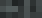
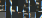

# Yet Another Ridiculous Acronym

https://www.dghack.fr/challenges/dghack/yet-another-ridiculous-acronym/

> Sauras-tu écrire une signature qui détecte le bon binaire à partir des marquants extraits dans l'analyse ci-jointe ?

Nous avons une image, accompagnée d'un [tgz](samples.tgz), qui contient plus de 900 versions d'un même programe sortant un potentiel flag positif.  Un seul des 900 est le bon.  


L'image semble présenter une capture de l'outil [radare2](https://github.com/radareorg/radare2).  Le bon binaire sera celui qui valide les 4 commandes, dont une est floutée en partie.  On va commencer par simplement éliminer ceux qui ne répondent pas correctement aux 3 premières.  Un script bash fera le travail. 

```sh
#!/bin/sh

FILES="/samples/sample*"
for f in $FILES
do
  
  COMMAND_1=$(
    echo "i~nx" \
    | r2 $f \
    | grep "false" \
    | wc -l
  )
  if [ $COMMAND_1 -ne 1 ]; then 
    continue
  fi 
  
  COMMAND_2=$(
    echo "pi 1" \
    | r2 $f \
    | grep "xor ebp, ebp" \
    | wc -l
  )
  if [ "$COMMAND_2" -ne 1 ]; then 
    continue
  fi 
  
  COMMAND_3=$(
    echo "ph md5 0x20 @ 0x0040404f" \
    | r2 $f \
    | grep "f3ea40bcc61066261ea3a018560434e2" \
    | wc -l
  )
  if [ "$COMMAND_3" -ne 1 ]; then 
    continue
  fi 
  
  hexdump $f > $f.hexdump
  
done
```

Cela ne nous en laisse que 131 sur le total.  A partir de ce point, j'ai testé plusieurs approches.  


## Première approche : le canal auxiliaire.

La 4ème commande de l'image est floutée, ce qui ne nous arrange pas vraiment.  Soit, il devrait être possible d'expérimenter [depix](https://github.com/beurtschipper/Depix), qui est un outil pour "récupérer les mots de passe à partir de captures d'écran pixelisées".  Et d'après les captures, c'est prometteur.  


Malheuresement, à partir de cet élement de l'image originale , je n'ai pas eu mieux que  comme résultat.  Il faut croire que sorti des conditions idéales, depix n'est pas parfait.  Où alors que je ne sais pas m'en servir.  


## Seconde approche : filtrer plus en avant.

Le résultat de la 4eme commande présente un pattern assez singulier.  Le premier [seizet](https://fr.wiktionary.org/wiki/seizet) et le troisième sont identiques, ainsi que le second et le quatrième.  Le permier et le second sont également différent entre eux.  Le XOR de la commande radare `pox ???? @ 0x0040????:` ne devrait pas avoir d'influence sur cette interprétation.  

J'ai tenté d'identifier ce type de patterns dans les binaires sans succès, car je n'ai pas eu de résultats probants.  

```python
import glob

files = glob.glob("/samples/sample*.hexdump")

for file in files:
  with open(file) as f:
    for line in f:
      array = line.split()
      if len(array) < 9:
        continue;
      if (array[1]==array[3] and 
          array[2]==array[4]):
        print(line, end='')
```

## Troisième approche : force brute

Une centaine de flags possible, cinq flags testables toutes les deux minutes avant de me faire jetter par le rate limiter.  Ca me donne au maximum 40 minutes pour tous les tester.  J'ai eu de la chance, en dix minutes c'était fini.  Ca n'est pas la méthode la plus honorable, mais au moins elle fonctionne :-)

Le flag était: `DGA{ca17ba40c5ae2eb3}`


