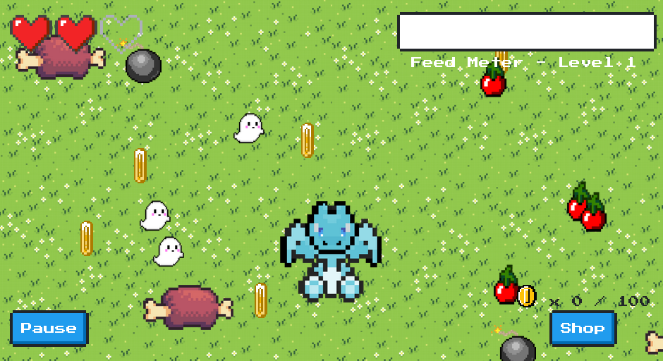

# Feed this dragon

> Voici le tout dernier jeu de type Clicker à la mode !
> 
> Il y a même un système de trophées mais l'un d'eux a l'air particulièrement difficile à obtenir...
> 
> Et l'obtenir semble débloquer une récompense secrète !
> 
> Mais est-ce "humainement" possible ?

L'url fournie pointe sur un petit jeu à cliquer: 

J'ai clairement overingénieuré ici, avec un script python qui joue au niveau de l'API du service, et qui simule des clics en rafale sur l'API.  Quick and dirty, mais ca fonctionne. 

[source](python.py)

